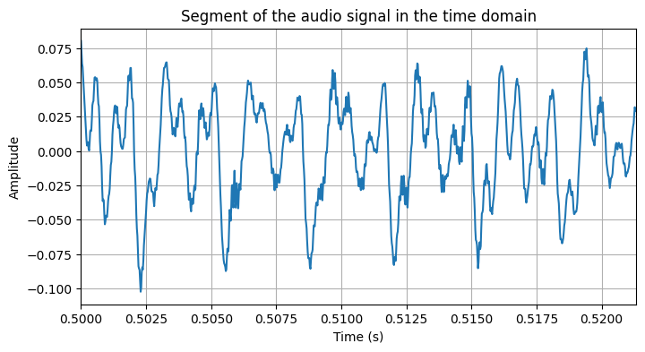
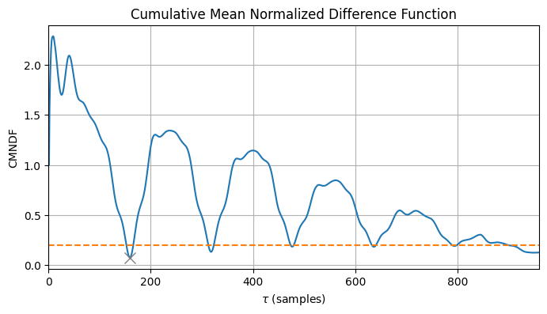
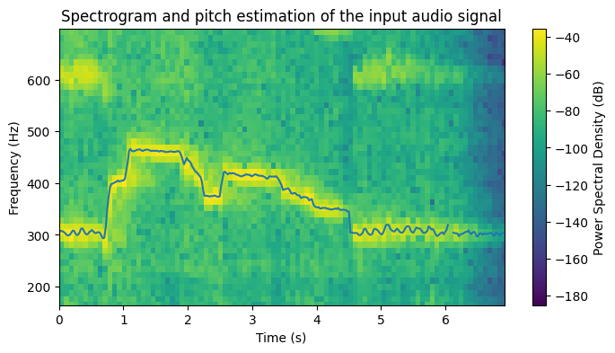
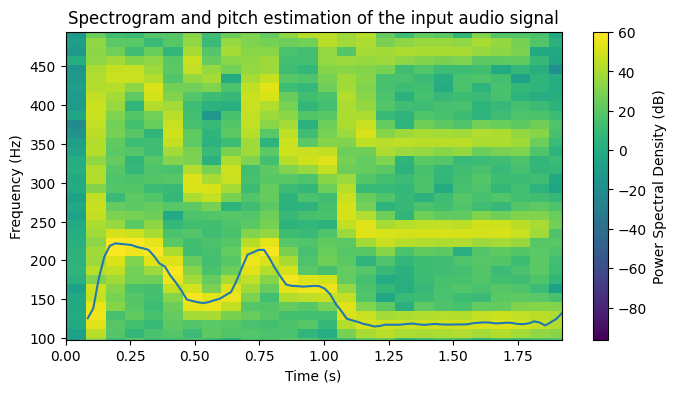
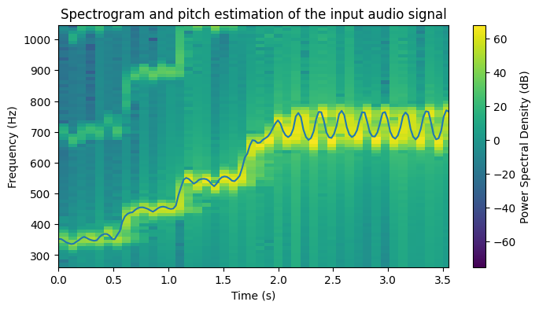
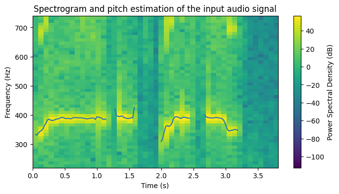

# YIN-Pitch
This repository contains a Python implementation of the YIN algorithm for fundamental frequency estimation. The YIN algorithm is a widely used method for estimating the fundamental frequency (pitch) of an audio signal. Based on the paper by Alain de Cheveigné and Hideki Kawahara, "YIN, a fundamental frequency estimator for speech and music", J. Acoust. Soc. Am. 111, 1917 (2002); https://doi.org/10.1121/1.1458024

## The YIN algorithm

The YIN algorithm is a time-domain method based on the computation of the Cumulative Mean Normalized Difference Function (CMNDF) to find the fundamental frequency of a given audio signal.
<div align="center">
  
  <p><em>Fragment of the input signal in the time domain.</em></p>
</div>

This implementation includes the following components:
- Calculation of the difference function and the CMNDF
- Threshold-based candidate for the fundamental frequency
- Parabolic interpolation to refine the estimate of the fundamental frequency
- Visualization of the pitch contour over a spectrogram

<div align="center">
  
  <p><em>Cmndf and predicted tau value.</em></p>
</div>

```
Predicted tau: 159.15 samples
Predicted fundamental frequency: 301.61 Hz
````


## Results

The script computes the estimated f0 values for the input signal and plots them on top of the spectrogram. The results of the pitch estimation for the different input audios (taken from [freesound.org](freesound.org)) are included next:

<div align="center">
  
  <p><em>Pitch estimation for the example sound 1 (Female alto vocal range)</em></p>
</div>

<div align="center">
  
  <p><em>Pitch estimation for the example sound 2 (Male baritone vocal range)</em></p>
</div>

<div align="center">
  
  <p><em>Pitch estimation for the example sound 3 (Female soprano vocal range)</em></p>
</div>

<div align="center">
  
  <p><em>Pitch estimation for the example sound 4 (Female mezzo soprano vocal range)</em></p>
</div>

## Usage

1. Clone the repository:

```bash
git clone https://github.com/ABSounds/YIN-Pitch.git
```

2. Install the required packages:

```bash
pip install numpy scipy matplotlib tqdm
```

3. Run the [`YIN_pitch.ipynb`](YIN_pitch.ipynb) Jupyter Notebook


## References

For more information on the YIN pitch estimation algorithm, please refer to the following paper:

- De Cheveigné, A., & Kawahara, H. (2002). YIN, a fundamental frequency estimator for speech and music. The Journal of the Acoustical Society of America, 111(4), 1917–1930. [DOI: 10.1121/1.1458024](https://doi.org/10.1121/1.1458024)

- Sounds taken from [freesound.org](https://freesound.org/):
  - Sound 1: [https://freesound.org/people/TheScarlettWitch89/sounds/427200/](https://freesound.org/people/TheScarlettWitch89/sounds/427200/)
  - Sound 2: [https://freesound.org/people/daalvinz/sounds/367215/](https://freesound.org/people/daalvinz/sounds/367215/)
  - Sound 3: [https://freesound.org/people/HerbertBoland/sounds/30084/](https://freesound.org/people/HerbertBoland/sounds/30084/)
  - Sound 4: [https://freesound.org/people/TheScarlettWitch89/sounds/417938/](https://freesound.org/people/TheScarlettWitch89/sounds/417938/)
